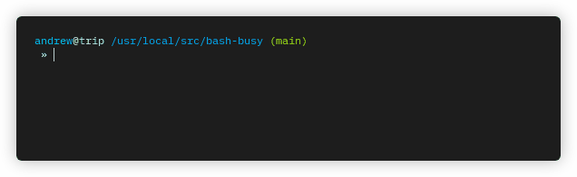

# busy
Simple animated busy indicator for Bash shell scripts



# Usage

The provided function accepts 2-3 arguments:

```bash
$ busy [delay] <prompt> <expression>
```

If the first argument (`[delay]`) appears to be a time duration (as recognized by `sleep(1)`), then it is used as the animated frame duration. Otherwise, the default `0.1s` is used.

The next argument is the prompt printed next to the animated busy string.

The final argument is a string that is passed to `eval` and determines how long to continue the busy loop. As long as the expression evaluates `false`, the busy loop continues running. Once it evaluates true, the busy loop exits and the function returns.

## Asynchronous tasks

Sometimes you may want to display a busy indicator while you wait for multiple long-running tasks to complete. Simply calling these tasks in the `eval` argument to `busy` is no good, since they will block the animation loop from continuing. In this case, I use the following pattern to spawn background jobs and iteratively test if they have all terminated or not:

```bash
# Verify no PID is still running.
finished() {
  for pid in ${@}; do
    # Signal 0 determines if PID exists and you have permission to signal it.
    kill -0 ${pid} &>/dev/null && return 1
  done
  return 0
}

# Create long-running tasks and store their PIDs in an associative array.
declare -A pid
for j in "${job[@]}"; do
  # Dispatch the process as a background job with "&".
  run-my-task "${j}" &
  # Save the PID
  pid[${j}]=${!}
done

# Now you can call `busy` with an eval expression that will return immediately.
# Note that you'll want to escape the eval string so it doesn't get expanded early.
busy 'waiting for background tasks to complete ...' 'finished "${pid[@]}"'
```

# Installation

Add function [`busy`](busy.bash) to one of your shell initialization scripts (e.g. `.bashrc`), or download the script in this repo and source it from your script:

```bash
. busy.bash
```
